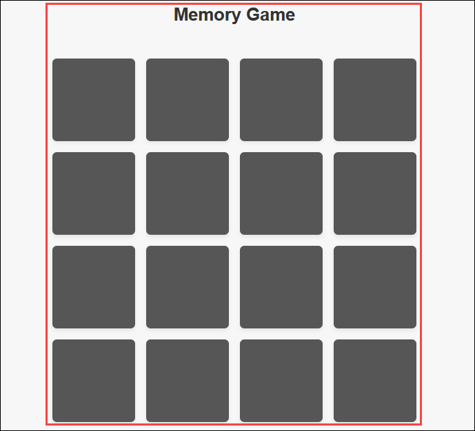
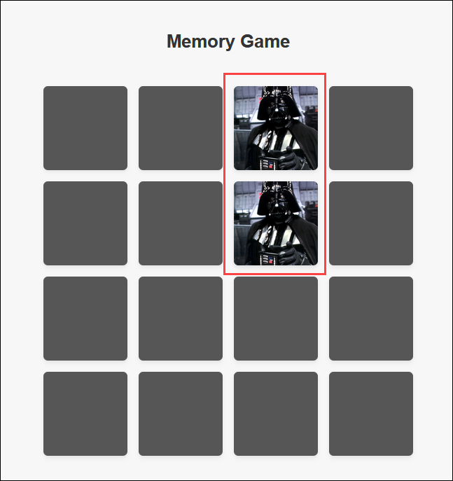

# Challenge 2: Develop a Memory Game 

### Estimated Time: 60 mins
  
## Introduction  

At Contoso Ltd., you're a software developer on a mission to create a fun and engaging Memory Game using GitHub Copilot as your coding assistant. The goal is to create a Memory Game where players match pairs of cards by flipping them over. If two cards match, they remain open; if not, they stay flipped down. The game ends when all pairs are matched, and the player wins.

You’ll use Copilot to help you set up the game board, write game logic, and build an intuitive user experience. By using Copilot Chat, you can ask for tips on improving code, get suggestions on game features, and refine the design as you go, making it a great opportunity to see how AI can enhance both your coding speed and quality.
  
## Prerequisites

- Basic understanding of the python and javascript programming language.  
- GitHub account.  

## Setting Up Visual Studio Code

1. Open Visual Studio Code, open `C:\Labfiles\GitHub-Copilot-Hack-memory-game` folder to get the code files.

1. In Visual Studio Code and install **GitHub Copilot** extension.

1. In your Visual Studio Code, open the integrated terminal and install python packages like `flask` and `requests`.

## Challenge Objectives  

Complete these objectives one by one, to complete the development of Memory Game Application.

1. **Objective 1:** In `script.js` file, complete the logic for 4x4 card grid creation in the memory game that supports one player. Use GitHub Copilot to generate codes.
     
1. **Objective 2:** In `script.js` file, complete the logic for shuffling the card after every game.

1. **Objective 3:** In `script.js` file, complete the function to check if both the cards are matched or not. Use GitHub copilot for assitance.

1. **Objective 4:** In `script.js` file, Create the function that decides the winner by checking if all the cards are matched or not. 
  
1. **Objectives 5:** In `app.py`, create the route in the python script that renders the memory game application. Explore Copilot's ability to understand your context and provide relevant code suggestions.

1. Start your application locally to test it thoroughly and ensure all functionalities work as expected.

   >Here are some example images of application, you can use it as reference.

   

   

   

1. As you have tested the application locally, deploy this to Azure App Services to make it accessible online.
      
## Success Criteria  

- Verify that the backend logic has been constructed properly
- Verify that all the functionalities in the application are working as expected. 
- Verify that the application is accessible online.

## Additional Resources:

- Refer to the [GitHub Copilot Documentation](https://github.com/github/copilot-docs) for any clarifications or guidance during the challenge.
  
### Challenge Validation

Provide the GitHub Username parameter in the **github-cloudlabsuser-XXXX** format for the **Validate the cloned Repo** validation step.

## Conclusion  
In this challenge, you've successfully developed a fully functional **Memory Game** application with significant assistance from **GitHub Copilot,** showcasing its practical value in software development. Throughout the process, you leveraged Copilot’s capabilities—from setting up the game grid and shuffling cards to implementing game logic and handling user interactions—demonstrating the efficiency and productivity boost AI can bring to development.

The engagement with Copilot Chat has enriched your collaboration and provided insightful coding recommendations, showcasing how AI can be seamlessly integrated into the development workflow. The test cases generated with GitHub Copilot's assistance have ensured the robustness and reliability of your application. Your achievements in this challenge have demonstrated the potential of AI in software development and provided valuable insights into its practical implementation. You've shown that with the right tools, such as GitHub Copilot, the development process can be made more efficient and productive.
  

