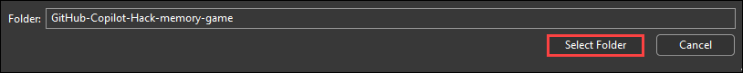
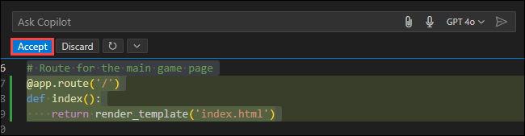
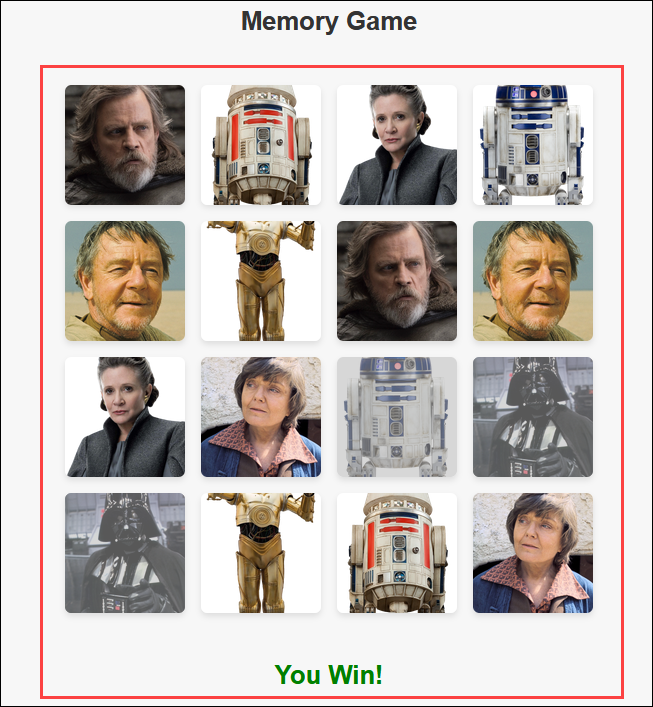
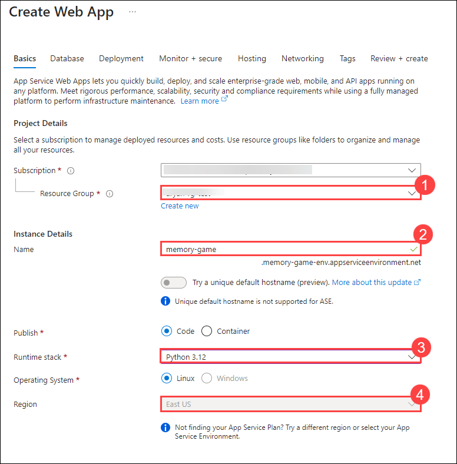
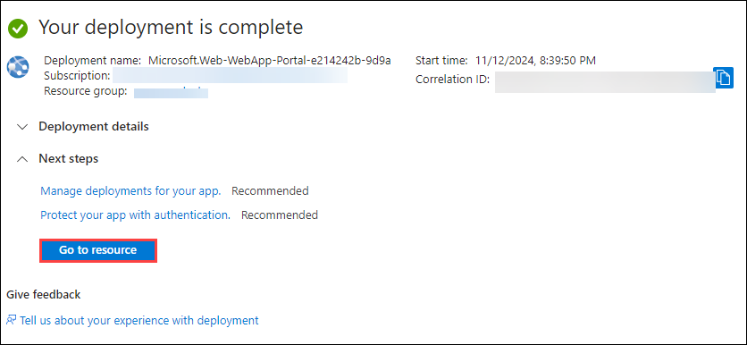

# Challenge 2: Develop a Memory Game  - Solution Guide

## Task 1: Develop a Memory Game

### Open Visual Studio Code and Navigate to Source Code

1. Launch Visual Studio and click on **open folder**.

   

1. In the select folder pane, navigate to `C:\Labfiles\GitHub-Copilot-Hack-memory-game` and click on select folder.

   

1. Once the directory is opened, it will look similar to this.

   

### Setting Up Visual Studio Code

1. In the Visual Studio Code select the **Extensions option**.

   

1. In the extension pane, search for **GitHub Copilot** and click on install to install GitHub copilot extension.

   

1. Wait till the GitHub Copilot extension installed successfully.

### Implement Missing Parts of the Backend Functions using GitHub Copilot
 
1. Navigate to the `script.js` file within the `static` folder.

   

### Objective 1 : Define logic for 4x4 card grid creation for the memory game that supports one player

The user will use GitHub Copilot to generate the missing part of function in `script.js` file, which defines the 4x4 card grid for a single-player game.
 
1. Use GitHub Copilot in the `script.js`file. To generate code for each empty function using GitHub Copilot, Select or highlight the lines of the empty functions, and then right-click on the highlighted lines to open the context menu.

   

1. From the context menu, choose the **Copilot** option and click on **Fix**.
 
   

1. GitHub Copilot will generate a code suggestion based on the context of the function. Review the suggestion provided by GitHub Copilot, and you can choose to **Accept or discard** the suggestion based on its relevance to your requirements.

   

### Objective 2: Creating the logic for shuffling the card after every game 

The user will use GitHub Copilot to generate the missing part of the function in `script.js` file, which creates the logic for shuffling the card after every game. 
 
1. Use GitHub Copilot in the `script.js`file. To generate code for each empty function using GitHub Copilot, Select or highlight the lines of the empty function, and then right-click on the highlighted lines to open the context menu.

   

1. From the context menu, choose the **Copilot** option and click on **Editor Inline Chat**.
   
   

1. Once after opening Inline Chat, paste the selected part of code in the **Ask Copilot** input box. GitHub Copilot will generate a code suggestion based on the context of the function. Review the suggestion provided by GitHub Copilot, and you can choose to **accept or discard** the suggestion based on its relevance to your requirements.

   

### Objective 3: Creating a function to check if both the cards are matched or not

The user will use GitHub Copilot to generate the missing part of function in `script.js` file, which creats a function to check if both the cards are matched or not.
 
1. Use GitHub Copilot in the `script.js`file. To generate code for each empty function using GitHub Copilot, Select or highlight the lines of the empty functions, and then right-click on the highlighted lines to open the context menu.

   
 
1. From the context menu, choose the **Copilot** option and click on **Fix**.
 
   

1. GitHub Copilot will generate a code suggestion based on the context of the function. Review the suggestion provided by GitHub Copilot, and you can choose to **Accept or discard** the suggestion based on its relevance to your requirements.

   

1. Following these steps will allow you to efficiently utilize GitHub Copilot to generate code for each empty function in the `script.js` file.

### Objective 4: Creat the function that decides the winner by checking if all the cards are matched or not

The user will use GitHub Copilot to generate the missing parts of functions in `script.js` file, which creats a function that decides the winner by checking if all the cards are matched or not
 
1. Use GitHub Copilot in the `script.js`file. To generate code for each empty function using GitHub Copilot, Select or highlight the lines of the empty functions, and then right-click on the highlighted lines to open the context menu.

   
   
1. From the context menu, choose the **Copilot** option and click on **Fix**.
 
   

1. GitHub Copilot will generate a code suggestion based on the context of the function. Review the suggestion provided by GitHub Copilot, and you can choose to **Accept or discard** the suggestion based on its relevance to your requirements.

   

1. Following these steps will allow you to efficiently utilize GitHub Copilot to generate code for each empty function in the `script.js` file.

1. Once after generating the code snippets, the final file will look similar to this.

   ```
      window.onload = function () {
      const gameBoard = document.getElementById('game-board');
      const winMessage = document.createElement('div');
      winMessage.id = 'win-message';
      winMessage.innerText = 'You Win!';
      document.body.appendChild(winMessage); // Append win message to the body
      const cards = [];

      fetch('/get-symbols')
         .then(response => response.json())
         .then(symbols => {
         // Create two cards for each symbol
         symbols.forEach(symbol => {
               cards.push(createCard(symbol));
               cards.push(createCard(symbol));
         });

         shuffle(cards);
         cards.forEach(card => {
               gameBoard.appendChild(card);
         });
         });

      function createCard(symbol) {
         const card = document.createElement('div');
         card.classList.add('card');
         card.dataset.symbol = symbol.name;

         const img = document.createElement('img');
         img.src = symbol.image;
         img.classList.add('card-image'); // Add a class for styling purposes
         card.appendChild(img);

         card.addEventListener('click', flipCard);

         return card;
      }

      function shuffle(array) {
         for (let i = array.length - 1; i > 0; i--) {
               const j = Math.floor(Math.random() * (i + 1));
               [array[i], array[j]] = [array[j], array[i]];
         }
      }

      let flippedCards = [];
      function flipCard() {
         if (flippedCards.length < 2 && !this.classList.contains('flipped') && !this.classList.contains('matched')) {
               this.classList.add('flipped');
               flippedCards.push(this);

               if (flippedCards.length === 2) {
                  setTimeout(checkMatch, 1000);
               }
         }
      }

      function checkMatch() {
         const [card1, card2] = flippedCards;

         if (card1.dataset.symbol === card2.dataset.symbol) {
               card1.classList.add('matched');
               card2.classList.add('matched');
         } else {
               card1.classList.remove('flipped');
               card2.classList.remove('flipped');
         }

         flippedCards = [];
         checkWin();
      }


      function checkWin() {
      // Check if all cards are matched
      if (cards.every(card => card.classList.contains('matched'))) {
         winMessage.style.display = 'block';
      }  
   }
   };
   ```

### Objective 5: Defining the route in the python script that renders the memory game application 

The user will use GitHub Copilot to generate the missing parts of functions in `script.js` file, which defines the route in the python script that renders the memory game application. 

1. Navigate to `app.py` file in your **GitHub-Copilot-Hack-memory-game** directory.

   
 
1. Use GitHub Copilot in the `app.py` file. To generate **route** to render the frontend of the application using GitHub Copilot, Select the comment, and then right-click on it to open the context menu.
 
   
 
1. From the context menu, choose the **Copilot** option and click on **Fix**.
 
   

1. GitHub Copilot will generate a code suggestion based on the context of the function. Review the suggestion provided by GitHub Copilot, and you can choose to **Accept or discard** the suggestion based on its relevance to your requirements.

   
 
1. Following these steps will allow you to efficiently utilize GitHub Copilot to generate code for creation of a route inside `app.py` file.

### Run and test the Application

1. Locate the app file **app.py** and right click **Open in Integreted Terminal**.

   

1. Run the below command to install requireed packages. 

   ```
    pip install flask requests
   ```

   

1. Once after the packages installed successfully, run the below command to start the memory-game application.

   ```
   python app.py
   ```

   

1. Once the command runs successfully, you can navigate to the URL and check your application.
  
   

1. Once after navigating to the URL, you will see your application interface like this.

   

1. Verify all the functionality is working as expected:

   - If two cards are matched, then they should remain open.

     
   
   - If all cards are matched then the user will win the game and a message should appear to indicate that.

     
   
   - Once after winning the match, ensure that you shuffling algorithm is working fine by refreshing the page once.

### Deploy Memory Game Application to Azure App Services

1. Before starting the deployment, you need to push the updated code files to GitHub.

1. Navigate to the Azure portal, search for *app service* and select the **App service**

   

1. Click on **+ Create (1)** drop-down and select **+ Web App (2)**  

   

1. On the **Create Web App** page, provide the following details.

   - **Resource Group:** **(1)**
   - **Name:** Enter **memory-game (2)**
   - **Runtime stack:** Select **Python 3.12 (3)** from drop-down
   - **Region:** Select **East US (4)**

      

   - **Linux Plan:** Click on **Create new** and provide name as **GitHubCopilot (1)**   

   - **Pricing plan:** Choose **Basic B1 (100 total ACU, 1.75 GB memory, 1 vCPU) (2)** and then click on **Next: Database (3)**

            

1. In the **Database** pane, leave everything as default. Click on **Next: Deployment**. 

1. On the **Deployement** page, 


1. Wait till the deployement is completed, once the deployement completes click on **Go to resource**. 

         

1. On the **App service** page, under *Deployment Center* you can see the deployment is **In Progress**. 

       

   >**Note:** It may take up to 15 minutes to complete the deployment process. Please wait till the status changes to success.

1. Once the deployment status is **successful**, from the *overview* pane use the **Default domain** URL to navigate to Memory Game application.

          

1. Once you navigate using the URL, you will be able to see the Memory Game application successfully hosted on the App service.

          

          

   >**Note:** If your not able to see the application please wait for additional 5 minutes. Refreh the page and try again.

